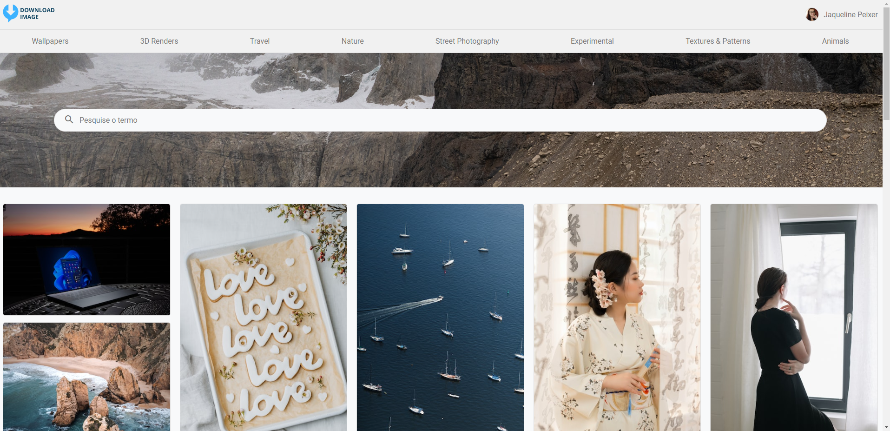

[Video no Youtube da demo do projeto](https://youtu.be/_3-sr_dCb4I)

<h2>Galeria de imagem em Angular</h2>

Este projeto foi desenvolvido com o objetivo de apresentar uma galeria de imagens com busca no banco de dados e com a possibilidade de estar realizando download da imagem em alta resolução.

## ⚠️ Resumo/Objetivo
O objetivo do projeto foi desenvolver uma **galeria de imagem** cujo dados eram objetidos através de **requisição REST com a API da Unsplash Images**. para a criação do layout e estrutura das telas teve como inspiração o site do [Pinterest](https://www.pinterest.com/), [Behance](http://behance.net/) e [Freepick](https://br.freepik.com/), após análise dos sites foi definido que o projeto seria constituido por uma **página inicial** e a **página de foto selecionada**. 

Onde a página principal irá apresentar campo de busca e a galeria com as principais imagens (ao iniciar) ou as imagens com o termo em seu nome (ao realizar a busca). Na página de foto selecionada será a apresentação da imagem em alta resolução, com os dados da imagem e o **botão de download**, o qual tem a função de abrir numa nova aba a imagem selecionada em tamanho full. Nas duas páginas conterá o menu que é constituido pelo logo do projeto, usuário (neste caso foi o perfil da autora no **Github obtido via API**) e a listagem dos 8 principais tópicos pesquisados no site da Unsplash.

## 🚀 Tecnologias 

- **Framework**: 
    - Angular 15
    - Typescript
    - SCSS
- **Banco de dados**: 
    - [API Unsplash Images](https://unsplash.com/developers)

---

Made with 🧡 by Jaqueline Peixer :wave: 

    
    

